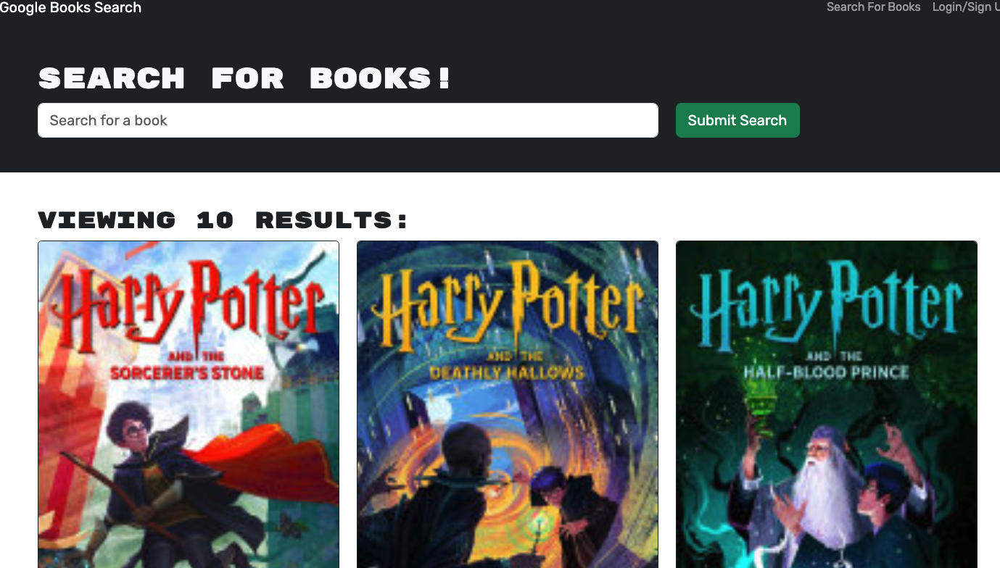
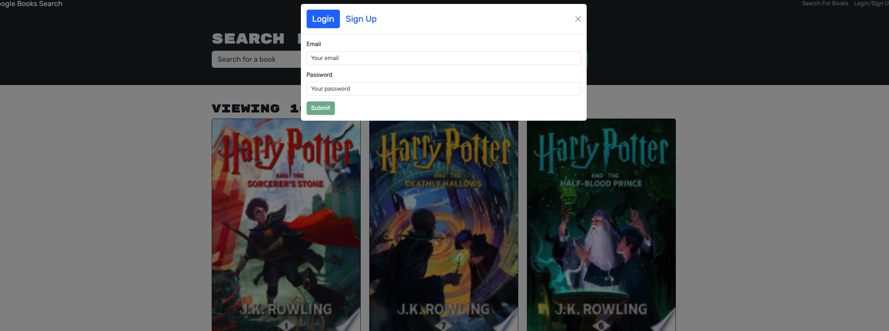

# Book Search Engine

    
## Description
This is a full-stack web application that allows users to search for books, save their favorite titles,delete them and manage their personal book collections. Users can create an account, log in, and securely store their data using JWT authentication. The app fetches book details from an external API and provides a seamless interface for managing saved books.
    
## Table of Contents
- [Installation](#installation)
- [License](#license)
- [Contributing](#contributing)
- [Tests](#tests)
- [Questions](#questions)
- [Screenshot](#screenshot)
- [DeployedLink](#deployedlink)
    
## Installation
```
npm install and npm run start : dev
```   

## License
This project is licensed under the MIT license.  
  
[More about MIT license](https://choosealicense.com/licenses/mit/)
    
    
## Contributing
Contributions are welcome!
    
## Tests
```
Currently, there are no tests available for this project.
```
    
## Questions
For any questions, please feel free to contact me at deepthi_thampi@hotmail. 
You can also find more of my work at [deepthithampi](https://github.com/deepthithampi).

## Screenshot




## DeployedLink

[book-search-engine](https://book-search-engine-eegb.onrender.com/)


